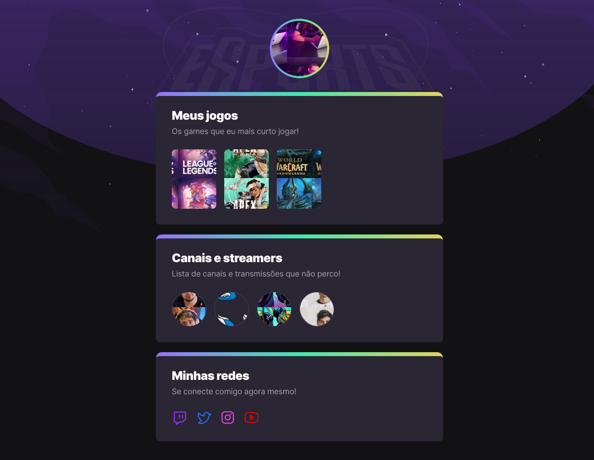

# 🚀 | NLW eSports

 
> Trilha Explorer
 
[🔗 Clique aqui para acessar](https://nlw-explorer.vercel.app/)
#
Projeto construído no evento Next Level Week (NLW) eSports da Rocketseat, como o professor Mayk brito. O layout acima é apena a base do que fo criado
#
 ## 📲 | CONTATO

 
  
  
  

